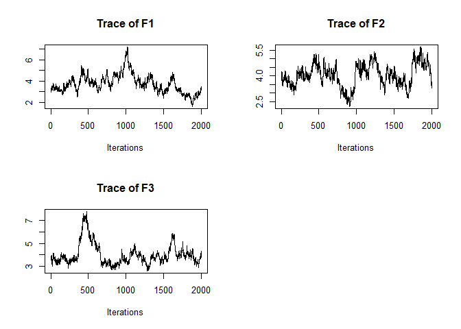
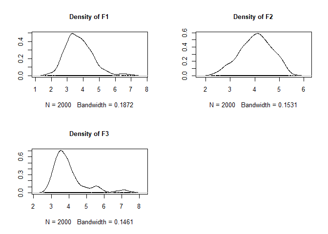
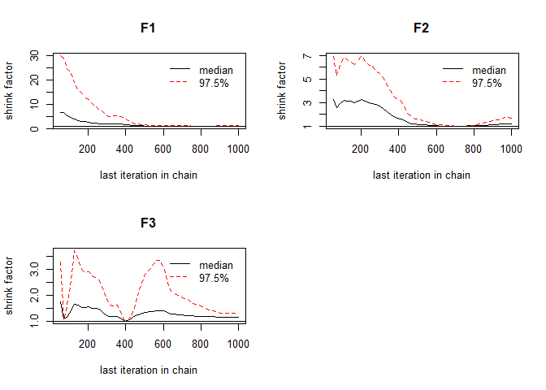

<!-- README.md is generated from README.Rmd. Please edit that file -->

# LAWBL: Latent (variable) Analysis with Bayesian Learning

The long-term goal of **LAWBL** is to provide a analytical framework for
modeling latent variables with different Bayesian learning methods.

Currently, this package includes the Partially Confirmatory Factor
Analysis (PCFA), a partially confirmatory approach covering a wide range
of the exploratory-confirmatory continuum in factor analytic models
(Chen, Guo, Zhang, & Pan, 2020). There are two major model variants with
different constraints for identification. One assumes local independence
(LI) with a more exploratory tendency, which can be also called the
E-step. The other allows local dependence (LD) with a more confirmatory
tendency, which can be also called the C-step. Parameters are obtained
by sampling from the posterior distributions with the Markov chain Monte
Carlo (MCMC) techniques. Different Bayesian Lasso methos are used to
regularize the loading pattern and local dependence.

Although only continuous data are supported currently, inclusion of
mixed-type data is on schedule. More Bayesian learning approaches will
be also included in future releases of this package.

Chen, J., Guo, Z., Zhang, L., & Pan, J. (2020). A partially confirmatory
approach to scale development with the Bayesian Lasso. *Psychological
Methods*. <http://dx.doi.org/10.1037/met0000293>.

## Installation

1)  Install the released version from [CRAN](https://CRAN.R-project.org)
    with:

<!-- end list -->

``` r
install.packages("LAWBL")
```

2)  Install the `devtools` package (if necessary), and install the
    development version from the Github.

<!-- end list -->

``` r
# install.packages("devtools")
devtools::install_github("Jinsong-Chen/LAWBL")
```

## Example

Estimation with local dependence:

``` r
library(LAWBL)
dat <- sim18cfa1$dat
J <- ncol(dat)
K <- 3
Q<-matrix(-1,J,K);
Q[1:6,1]<-Q[7:12,2]<-Q[13:18,3]<-1
Q
#>       [,1] [,2] [,3]
#>  [1,]    1   -1   -1
#>  [2,]    1   -1   -1
#>  [3,]    1   -1   -1
#>  [4,]    1   -1   -1
#>  [5,]    1   -1   -1
#>  [6,]    1   -1   -1
#>  [7,]   -1    1   -1
#>  [8,]   -1    1   -1
#>  [9,]   -1    1   -1
#> [10,]   -1    1   -1
#> [11,]   -1    1   -1
#> [12,]   -1    1   -1
#> [13,]   -1   -1    1
#> [14,]   -1   -1    1
#> [15,]   -1   -1    1
#> [16,]   -1   -1    1
#> [17,]   -1   -1    1
#> [18,]   -1   -1    1
mod1 <- pcfa(dat = dat, Q = Q,LD = T, burn = 2000, iter = 2000)
#> Tot. Iter = 1000
#>    user  system elapsed 
#>   16.92    0.03   16.99 
#>          [,1]  [,2]  [,3]
#> eigen   3.064 4.616 3.723
#> Nla_ns3 8.000 8.000 8.000
#> Mgammal 2.615 2.236 2.779
#> [1] LD>=.2 >=.1   gammas
#> [1] 5.00 8.00 2.27
#> Tot. Iter = 2000
#>    user  system elapsed 
#>   37.14    0.06   37.49 
#>          [,1]  [,2]  [,3]
#> eigen   3.255 3.719 3.600
#> Nla_ns3 7.000 8.000 8.000
#> Mgammal 2.139 2.585 2.918
#> [1] LD>=.2 >=.1   gammas
#> [1]  5.000 10.000  2.027
#> Tot. Iter = 3000
#>    user  system elapsed 
#>   56.56    0.07   57.11 
#>          [,1]  [,2]  [,3]
#> eigen   6.498 4.550 3.372
#> Nla_ns3 8.000 9.000 8.000
#> Mgammal 2.794 2.236 3.063
#> [1] LD>=.2 >=.1   gammas
#> [1]  3.00 13.00  2.17
#> PGR mean & max: 1.26 1.963
#> Tot. Iter = 4000
#>    user  system elapsed 
#>   71.64    0.07   72.19 
#>          [,1]  [,2]  [,3]
#> eigen   3.193 3.644 3.951
#> Nla_ns3 8.000 8.000 8.000
#> Mgammal 2.257 2.720 2.468
#> [1] LD>=.2 >=.1   gammas
#> [1] 6.000 6.000 2.007
#> PGR mean & max: 1.161 1.717
summary(mod1) # summarize basic information
#> $N
#> [1] 500
#> 
#> $J
#> [1] 18
#> 
#> $K
#> [1] 3
#> 
#> $`Miss%`
#> [1] 0
#> 
#> $`LD enabled`
#> [1] TRUE
#> 
#> $`Burn in`
#> [1] 2000
#> 
#> $Iteration
#> [1] 2000
#> 
#> $`No. of sig lambda`
#> [1] 20
#> 
#> $`No. of sig LD terms`
#> [1] 6
summary(mod1, what = 'qlambda') #summarize significant loadings in pattern/Q-matrix format
#>          [,1]      [,2]      [,3]
#> I1  0.6906979 0.0000000 0.0000000
#> I2  0.6712106 0.0000000 0.0000000
#> I3  0.8291455 0.0000000 0.0000000
#> I4  0.8116327 0.0000000 0.0000000
#> I5  0.6693932 0.0000000 0.0000000
#> I6  0.6897779 0.0000000 0.0000000
#> I7  0.0000000 0.7655253 0.0000000
#> I8  0.0000000 0.6359014 0.0000000
#> I9  0.0000000 0.7686008 0.0000000
#> I10 0.0000000 0.7750993 0.0000000
#> I11 0.0000000 0.7565016 0.3379911
#> I12 0.0000000 0.7565317 0.3201217
#> I13 0.0000000 0.0000000 0.7343109
#> I14 0.0000000 0.0000000 0.7100420
#> I15 0.0000000 0.0000000 0.8511923
#> I16 0.0000000 0.0000000 0.8054014
#> I17 0.0000000 0.0000000 0.7444882
#> I18 0.0000000 0.0000000 0.7539096
summary(mod1, what = 'offpsx') #summarize significant LD terms
#>        row col       est         sd      lower     upper sig
#> var14   14   1 0.2698983 0.04639706 0.17846006 0.3583986   1
#> var24    7   2 0.2345643 0.05905735 0.12107695 0.3526704   1
#> var37    4   3 0.2498024 0.10808551 0.04266214 0.4639732   1
#> var111  13   8 0.3015892 0.05614366 0.17712431 0.4054719   1
#> var118  10   9 0.2474781 0.07956412 0.08488296 0.3930728   1
#> var163  16  15 0.2065549 0.08615945 0.03427149 0.3486278   1

plot_eigen(mod1) # trace
```



``` r
plot_eigen(mod1, what='density')
```



``` r
plot_eigen(mod1, what='PGR')
```


